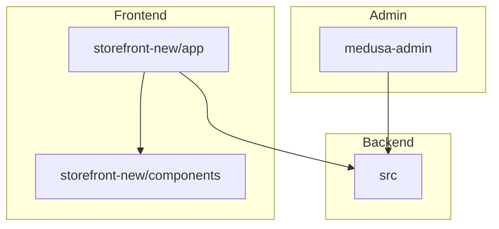

# Code Review Plan (Excluding "mystery" folders and `storefront/`)

## Scope

**Excluded:**
- All directories/files with "mystery" in the name
- Entire `storefront/` directory

**Included:**
- `storefront-new/` (modern Next.js frontend)
- `medusa-admin/` (admin panel)
- Potentially `src/` (no code definitions found, so low priority)

---

## High-Level Architecture Overview

- **`storefront-new/`**: Customer-facing Next.js app with modular components and context providers.
- **`medusa-admin/`**: Admin panel, mostly configuration detected.
- **`src/`**: Backend configs, no detected code definitions.

---

## Key Components and Features

### `storefront-new/`

- **App Shell (`app/layout.tsx`)**: Nested providers (Error, Auth, Store, Cart, Wishlist).
- **Pages**: Home, Not Found, Template.
- **Components**:
  - Cart: `AddToCartButton`, `CartItemList`, `CartSummary`, `MiniCart`
  - Product: `ProductCard`, `ProductDetails`, `ProductGrid`, `ProductFilters`, `VariantSelector`
  - UI: `Header`, `Footer`, `Pagination`, `SearchBar`, `NewsletterForm`, `WishlistButton`
  - Utilities: `ErrorBoundary`, `SafeImage`, `SkeletonLoader`
  - Filtering/Sorting: `FilterSortSystem`
- **Middleware**: Custom Next.js middleware.
- **Styling**: Tailwind CSS with custom themes.
- **Docs**: Layout fixes, redesign plans, page transitions.

### `medusa-admin/`

- Config files: Tailwind, TypeScript, package.json
- No detected React components or business logic at the top level
- Likely a Vite + React admin panel

---

## Review Focus Areas

1. **Frontend (`storefront-new/`)**
   - Context provider hierarchy
   - Component modularity and reusability
   - Async handling (loading, errors)
   - Accessibility and responsiveness
   - Code consistency and best practices

2. **Admin Panel (`medusa-admin/`)**
   - Configuration hygiene
   - Tailwind and TypeScript setup
   - Package management and scripts

3. **Backend (`src/`)**
   - Low priority unless specified

---

## Next Steps

- Perform targeted code searches (TODOs, anti-patterns)
- Check for common issues:
  - Unhandled promises
  - Deeply nested JSX
  - Inline styles or magic strings
  - Missing error handling
  - Accessibility concerns
- Summarize findings and suggest improvements

---

*Generated on 2025-04-06*