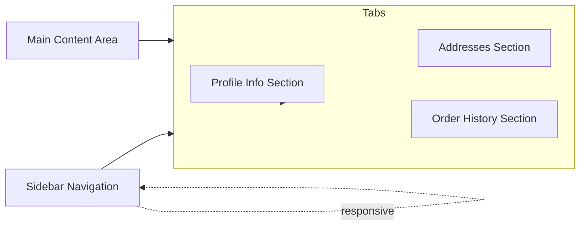

# `/us/account` Page Redesign Plan

---

## **Scope**

- Improve clarity, usability, and aesthetics.
- Organize into clear sections:
  - Profile Info (name, email, password change)
  - Addresses (list, add, edit, delete, set default)
  - Order History
- Use two-column layout or tabs for navigation.
- Add section headers, icons, consistent styling.
- Use modals or inline forms for editing.
- Improve feedback with spinners, success/error messages.
- Ensure responsive design and accessibility.
- **Keep existing color scheme and branding.**

---

## **1. Overall Layout**

- **Two-column layout** on desktop:
  - **Sidebar:** User info + navigation tabs.
  - **Content area:** Active section.
- **Tabs:** Profile Info, Addresses, Order History.
- **Responsive:** Sidebar collapses or becomes top nav on mobile.

---

## **2. Sidebar Navigation**

- **Icons** next to tab labels:
  - 👤 Profile Info
  - 🏠 Addresses
  - 📦 Orders
- **Highlight active tab.**
- **Accessible:** ARIA labels, focus states.
- **User avatar:** initials or image, subtle border.
- **Sign out button** at bottom.

---

## **3. Profile Info Section**

- **Header:** "Profile Information" + edit icon/button.
- **Display:**
  - Name
  - Email
  - Phone
  - Member since
- **Edit mode:**
  - Inline form or modal.
  - Password change fields.
  - Validation, inline errors.
  - Save/Cancel buttons with loading spinner.
- **Consistent styling** with rounded inputs, spacing.

---

## **4. Addresses Section**

- **Header:** "Your Addresses" + "Add New Address" button.
- **Cards:**
  - Name, address, phone.
  - **Badges** for default addresses.
  - **Edit/Delete** buttons with icons.
- **Add/Edit:**
  - Modal or inline form.
  - Fields: Name, Address 1/2, City, State, Postal Code, Country, Phone.
  - Set as default checkbox.
  - Validation, feedback.
- **Delete confirmation modal.**
- **Loading indicators** during API calls.

---

## **5. Order History Section**

- **Header:** "Order History"
- **Table/List:**
  - Order ID, Date, Status (badge), Total, Items, View button.
- **Empty state:** Message + "Browse Products" CTA.
- **Loading spinner** while fetching.
- **Pagination/infinite scroll** (future).

---

## **6. Visual & Interaction Enhancements**

- **Consistent styling** with Tailwind CSS.
- **Icons:** Heroicons or similar.
- **Feedback:**
  - Loading spinners.
  - Success toasts or inline.
  - Error alerts.
- **Accessibility:**
  - Keyboard navigable.
  - ARIA roles/labels.
  - Color contrast.
  - Focus outlines.

---

## **7. Optional Future Enhancements**

- Profile picture upload.
- Address autocomplete.
- Order filtering/search.
- Saved payment methods.

---

## **Mermaid Diagram**

---

## **Summary**

- Clear separation of sections.
- Tabs + two-column layout.
- Icons, headers, consistent styling.
- Inline forms/modals for editing.
- Feedback and accessibility.
- **Color scheme remains unchanged.**