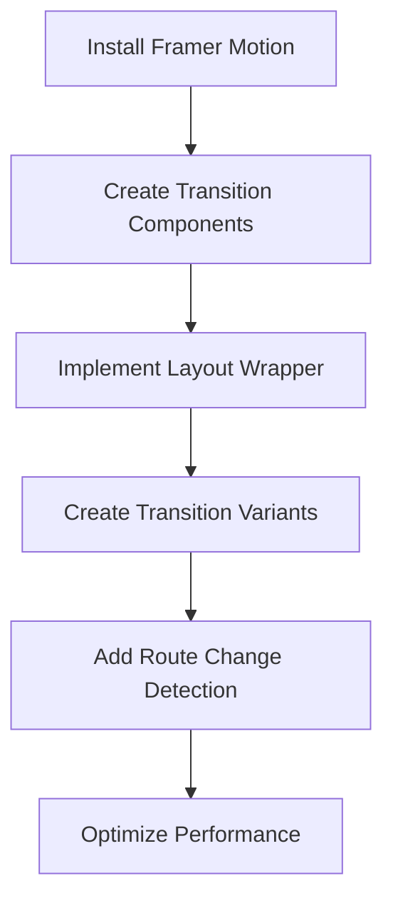

# Implementation Plan: Page Transitions with Framer Motion

## Overview

Page transitions will significantly enhance the user experience of the AndMore Tech storefront by creating smooth, professional animations between pages. This plan outlines how to implement page transitions using Framer Motion in the Next.js-based storefront-new project.



## 1. Installation and Setup

### Dependencies
First, we need to install Framer Motion in the storefront-new project:

```bash
cd storefront-new
npm install framer-motion
```

### Configuration
Framer Motion works well with Next.js out of the box, but we'll need to configure it to work with Next.js App Router:

```tsx
// storefront-new/app/layout.tsx
import { Metadata } from "next";
import { Geist, Geist_Mono } from "next/font/google";
import "./globals.css";

const geistSans = Geist({
  variable: "--font-geist-sans",
  subsets: ["latin"],
});

const geistMono = Geist_Mono({
  variable: "--font-geist-mono",
  subsets: ["latin"],
});

export const metadata: Metadata = {
  title: "AndMore Tech - Mobile Devices, Accessories & More",
  description: "Premium tech products and accessories from trusted brands",
};

export default function RootLayout({
  children,
}: Readonly<{
  children: React.ReactNode;
}>) {
  return (
    <html lang="en">
      <body
        className={`${geistSans.variable} ${geistMono.variable} antialiased`}
      >
        {/* We'll add our transition wrapper here */}
        <main className="min-h-screen">
          {children}
        </main>
      </body>
    </html>
  );
}
```

## 2. Creating Transition Components

### Page Transition Wrapper

We'll create a client component that wraps each page and handles the animations:

```tsx
// storefront-new/components/transitions/PageTransition.tsx
'use client'

import { motion, AnimatePresence } from 'framer-motion';
import { usePathname } from 'next/navigation';
import { ReactNode } from 'react';

interface PageTransitionProps {
  children: ReactNode;
}

export default function PageTransition({ children }: PageTransitionProps) {
  const pathname = usePathname();
  
  return (
    <AnimatePresence mode="wait">
      <motion.div
        key={pathname}
        initial={{ opacity: 0 }}
        animate={{ opacity: 1 }}
        exit={{ opacity: 0 }}
        transition={{ duration: 0.3 }}
      >
        {children}
      </motion.div>
    </AnimatePresence>
  );
}
```

### Template Component

Next, we'll create a template component that will be used in the layout to apply transitions:

```tsx
// storefront-new/app/template.tsx
'use client'

import PageTransition from '../components/transitions/PageTransition';
import { ReactNode } from 'react';

export default function Template({ children }: { children: ReactNode }) {
  return <PageTransition>{children}</PageTransition>;
}
```

## 3. Transition Variants

Let's create different transition variants that can be used throughout the site:

```tsx
// storefront-new/components/transitions/variants.ts
export const fadeIn = {
  initial: { opacity: 0 },
  animate: { opacity: 1 },
  exit: { opacity: 0 },
  transition: { duration: 0.3 }
};

export const slideUp = {
  initial: { opacity: 0, y: 20 },
  animate: { opacity: 1, y: 0 },
  exit: { opacity: 0, y: -20 },
  transition: { duration: 0.3 }
};

export const slideFromRight = {
  initial: { opacity: 0, x: 20 },
  animate: { opacity: 1, x: 0 },
  exit: { opacity: 0, x: -20 },
  transition: { duration: 0.3 }
};

export const scale = {
  initial: { opacity: 0, scale: 0.95 },
  animate: { opacity: 1, scale: 1 },
  exit: { opacity: 0, scale: 1.05 },
  transition: { duration: 0.3 }
};
```

### Enhanced Page Transition Component

Now let's enhance our PageTransition component to support different transition types:

```tsx
// storefront-new/components/transitions/PageTransition.tsx (updated)
'use client'

import { motion, AnimatePresence } from 'framer-motion';
import { usePathname } from 'next/navigation';
import { ReactNode } from 'react';
import { fadeIn, slideUp, slideFromRight, scale } from './variants';

interface PageTransitionProps {
  children: ReactNode;
  variant?: 'fade' | 'slide-up' | 'slide-right' | 'scale';
}

export default function PageTransition({ 
  children, 
  variant = 'fade' 
}: PageTransitionProps) {
  const pathname = usePathname();
  
  // Select the appropriate variant
  const getVariant = () => {
    switch (variant) {
      case 'slide-up':
        return slideUp;
      case 'slide-right':
        return slideFromRight;
      case 'scale':
        return scale;
      case 'fade':
      default:
        return fadeIn;
    }
  };
  
  const selectedVariant = getVariant();
  
  return (
    <AnimatePresence mode="wait">
      <motion.div
        key={pathname}
        initial={selectedVariant.initial}
        animate={selectedVariant.animate}
        exit={selectedVariant.exit}
        transition={selectedVariant.transition}
      >
        {children}
      </motion.div>
    </AnimatePresence>
  );
}
```

## 4. Route-Specific Transitions

We can create a mapping of routes to transition types to have different transitions for different sections of the site:

```tsx
// storefront-new/components/transitions/routeTransitions.ts
type RouteTransitionMap = {
  [key: string]: 'fade' | 'slide-up' | 'slide-right' | 'scale';
};

export const routeTransitions: RouteTransitionMap = {
  '/': 'fade',
  '/categories': 'slide-right',
  '/products': 'scale',
  '/cart': 'slide-up',
  '/login': 'fade',
  '/register': 'fade',
  '/deals': 'scale',
};

export function getTransitionForRoute(pathname: string): 'fade' | 'slide-up' | 'slide-right' | 'scale' {
  // Check for exact matches
  if (routeTransitions[pathname]) {
    return routeTransitions[pathname];
  }
  
  // Check for partial matches (for nested routes)
  for (const route in routeTransitions) {
    if (pathname.startsWith(route) && route !== '/') {
      return routeTransitions[route];
    }
  }
  
  // Default transition
  return 'fade';
}
```

### Updated Template Component

Now we can update our template component to use route-specific transitions:

```tsx
// storefront-new/app/template.tsx (updated)
'use client'

import PageTransition from '../components/transitions/PageTransition';
import { getTransitionForRoute } from '../components/transitions/routeTransitions';
import { usePathname } from 'next/navigation';
import { ReactNode } from 'react';

export default function Template({ children }: { children: ReactNode }) {
  const pathname = usePathname();
  const transitionVariant = getTransitionForRoute(pathname);
  
  return (
    <PageTransition variant={transitionVariant}>
      {children}
    </PageTransition>
  );
}
```

## 5. Element Transitions

In addition to page transitions, we can create components for animating individual elements:

```tsx
// storefront-new/components/transitions/FadeIn.tsx
'use client'

import { motion } from 'framer-motion';
import { ReactNode } from 'react';

interface FadeInProps {
  children: ReactNode;
  delay?: number;
  duration?: number;
  className?: string;
}

export default function FadeIn({ 
  children, 
  delay = 0, 
  duration = 0.5,
  className = '' 
}: FadeInProps) {
  return (
    <motion.div
      initial={{ opacity: 0 }}
      animate={{ opacity: 1 }}
      transition={{ duration, delay }}
      className={className}
    >
      {children}
    </motion.div>
  );
}
```

```tsx
// storefront-new/components/transitions/SlideIn.tsx
'use client'

import { motion } from 'framer-motion';
import { ReactNode } from 'react';

interface SlideInProps {
  children: ReactNode;
  direction?: 'up' | 'down' | 'left' | 'right';
  delay?: number;
  duration?: number;
  className?: string;
}

export default function SlideIn({ 
  children, 
  direction = 'up',
  delay = 0, 
  duration = 0.5,
  className = '' 
}: SlideInProps) {
  const directionMap = {
    up: { y: 20, x: 0 },
    down: { y: -20, x: 0 },
    left: { x: 20, y: 0 },
    right: { x: -20, y: 0 }
  };
  
  const { x, y } = directionMap[direction];
  
  return (
    <motion.div
      initial={{ opacity: 0, x, y }}
      animate={{ opacity: 1, x: 0, y: 0 }}
      transition={{ duration, delay }}
      className={className}
    >
      {children}
    </motion.div>
  );
}
```

## 6. Staggered Animations

For lists of items (like product grids), we can create staggered animations:

```tsx
// storefront-new/components/transitions/StaggeredList.tsx
'use client'

import { motion } from 'framer-motion';
import { ReactNode } from 'react';

interface StaggeredListProps {
  children: ReactNode[];
  staggerDelay?: number;
  duration?: number;
  className?: string;
}

export default function StaggeredList({ 
  children, 
  staggerDelay = 0.1, 
  duration = 0.5,
  className = '' 
}: StaggeredListProps) {
  const container = {
    hidden: { opacity: 0 },
    show: {
      opacity: 1,
      transition: {
        staggerChildren: staggerDelay
      }
    }
  };
  
  const item = {
    hidden: { opacity: 0, y: 20 },
    show: { opacity: 1, y: 0, transition: { duration } }
  };
  
  return (
    <motion.div
      variants={container}
      initial="hidden"
      animate="show"
      className={className}
    >
      {children.map((child, index) => (
        <motion.div key={index} variants={item}>
          {child}
        </motion.div>
      ))}
    </motion.div>
  );
}
```

## 7. Loading Indicator

We can also create a loading indicator that appears during page transitions:

```tsx
// storefront-new/components/transitions/LoadingIndicator.tsx
'use client'

import { motion } from 'framer-motion';
import { usePathname, useSearchParams } from 'next/navigation';
import { useEffect, useState } from 'react';

export default function LoadingIndicator() {
  const pathname = usePathname();
  const searchParams = useSearchParams();
  const [isLoading, setIsLoading] = useState(false);
  
  useEffect(() => {
    const handleStart = () => setIsLoading(true);
    const handleComplete = () => setIsLoading(false);
    
    // This is a simplified approach - in a real app, you'd use Next.js Router events
    // or a custom solution for App Router
    
    return () => {
      // Cleanup
    };
  }, [pathname, searchParams]);
  
  if (!isLoading) return null;
  
  return (
    <div className="fixed top-0 left-0 right-0 z-50 h-1 bg-gray-200">
      <motion.div
        className="h-full bg-[var(--primary)]"
        initial={{ width: 0 }}
        animate={{ width: '100%' }}
        transition={{ duration: 0.5 }}
      />
    </div>
  );
}
```

## 8. Implementation in Layout

Finally, we'll update our root layout to include the loading indicator:

```tsx
// storefront-new/app/layout.tsx (updated)
import { Metadata } from "next";
import { Geist, Geist_Mono } from "next/font/google";
import "./globals.css";
import LoadingIndicator from '../components/transitions/LoadingIndicator';

const geistSans = Geist({
  variable: "--font-geist-sans",
  subsets: ["latin"],
});

const geistMono = Geist_Mono({
  variable: "--font-geist-mono",
  subsets: ["latin"],
});

export const metadata: Metadata = {
  title: "AndMore Tech - Mobile Devices, Accessories & More",
  description: "Premium tech products and accessories from trusted brands",
};

export default function RootLayout({
  children,
}: Readonly<{
  children: React.ReactNode;
}>) {
  return (
    <html lang="en">
      <body
        className={`${geistSans.variable} ${geistMono.variable} antialiased`}
      >
        <LoadingIndicator />
        <main className="min-h-screen">
          {children}
        </main>
      </body>
    </html>
  );
}
```

## 9. Usage Examples

### Using Transitions in Pages

```tsx
// Example usage in a category page
import ProductCard from '../../components/ProductCard';
import StaggeredList from '../../components/transitions/StaggeredList';
import FadeIn from '../../components/transitions/FadeIn';

export default function CategoryPage() {
  return (
    <>
      <Header />
      <div className="container mx-auto px-4 py-8">
        <FadeIn>
          <h1 className="text-3xl font-bold mb-8">Category Name</h1>
        </FadeIn>
        
        <StaggeredList className="grid grid-cols-1 md:grid-cols-3 gap-6">
          {products.map(product => (
            <ProductCard key={product.id} product={product} />
          ))}
        </StaggeredList>
      </div>
      <Footer />
    </>
  );
}
```

## 10. Performance Considerations

- Use `will-change` CSS property for elements that will animate
- Keep animations simple and short (under 500ms)
- Use hardware-accelerated properties (transform, opacity) when possible
- Implement lazy loading for images and components
- Consider reducing animations for users with reduced motion preferences

```tsx
// Example of respecting user preferences
'use client'

import { useReducedMotion } from 'framer-motion';

export function useAnimationPreference() {
  const prefersReducedMotion = useReducedMotion();
  
  return {
    shouldAnimate: !prefersReducedMotion,
    duration: prefersReducedMotion ? 0 : 0.3,
  };
}
```

## Implementation Steps

1. Install Framer Motion
2. Create the transition components (PageTransition, FadeIn, SlideIn, StaggeredList)
3. Create the transition variants and route mapping
4. Implement the template component
5. Add the loading indicator
6. Update the layout component
7. Test transitions between different pages
8. Optimize for performance

## Expected Outcome

After implementing these page transitions, the AndMore Tech storefront will have:

- Smooth, professional transitions between pages
- Consistent animation patterns throughout the site
- Improved perceived performance with loading indicators
- Enhanced user experience with subtle motion cues
- A more premium, polished feel that aligns with the tech brand identity