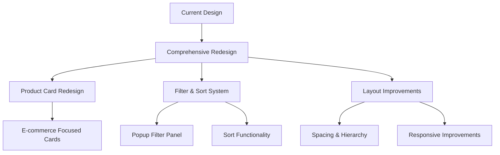

# Comprehensive Redesign Plan for AndMore Tech Storefront

## Overview

This plan outlines a complete redesign of the AndMore Tech storefront to create a more modern, user-friendly e-commerce experience. We'll focus on three key areas:

1. Product card redesign
2. Filter and sort functionality
3. Overall layout improvements



## 1. Product Card Redesign

### Current Issues:
- Cards resemble news articles rather than products
- Images aren't prominent enough
- Price and action buttons lack emphasis
- Product status (new, sale) isn't visually distinct

### Redesign Approach:

#### Component Structure:
```tsx
<ProductCard>
  <ProductBadges /> {/* New, Sale, etc. */}
  <ProductImage>
    <QuickActions /> {/* Quick view, wishlist */}
  </ProductImage>
  <ProductInfo>
    <ProductBrand />
    <ProductTitle />
    <ProductPrice />
    <ProductRating /> {/* If applicable */}
  </ProductInfo>
  <AddToCartButton />
</ProductCard>
```

#### Visual Design:
- **Card Container**: Subtle shadow, rounded corners, white background
- **Image**: Larger (60-70% of card height), consistent aspect ratio (1:1)
- **Badges**: Positioned top-right, colorful but on-brand (blue for new, gold for sale)
- **Typography**: Clear hierarchy with brand name smaller than product name
- **Price**: Prominent with sale prices showing original price struck through
- **Add to Cart**: Full-width button at bottom with brand color

#### Hover States:
- Subtle shadow increase
- Quick action buttons appear over image
- Zoom effect on image (105-110%)
- Add to cart button color change

### Implementation Example:

```tsx
// components/ProductCard.tsx
'use client'

import Image from 'next/image'
import { useState } from 'react'
import { motion } from 'framer-motion'

interface ProductCardProps {
  id: string
  title: string
  brand: string
  description: string
  price: number
  originalPrice?: number
  thumbnail: string
  isNew?: boolean
  isOnSale?: boolean
  rating?: number
  currencyCode?: string
  onAddToCart: () => void
  onQuickView?: () => void
  onAddToWishlist?: () => void
}

export default function ProductCard({
  id,
  title,
  brand,
  description,
  price,
  originalPrice,
  thumbnail,
  isNew,
  isOnSale,
  rating = 0,
  currencyCode = 'EUR',
  onAddToCart,
  onQuickView,
  onAddToWishlist
}: ProductCardProps) {
  const [isHovered, setIsHovered] = useState(false)
  
  const formatter = new Intl.NumberFormat('en-US', {
    style: 'currency',
    currency: currencyCode,
    minimumFractionDigits: 2
  })
  
  return (
    <motion.div 
      className="bg-white rounded-lg overflow-hidden shadow-sm hover:shadow-md transition-shadow duration-300"
      onMouseEnter={() => setIsHovered(true)}
      onMouseLeave={() => setIsHovered(false)}
      whileHover={{ y: -5 }}
      transition={{ duration: 0.2 }}
    >
      {/* Product image with badges and quick actions */}
      <div className="relative aspect-square overflow-hidden">
        <div className="absolute top-2 right-2 z-10 flex flex-col gap-2">
          {isNew && (
            <span className="bg-[var(--primary)] text-white text-xs font-bold px-2 py-1 rounded">NEW</span>
          )}
          {isOnSale && (
            <span className="bg-[var(--secondary)] text-white text-xs font-bold px-2 py-1 rounded">SALE</span>
          )}
        </div>
        
        <Image
          src={thumbnail}
          alt={title}
          width={500}
          height={500}
          className={`w-full h-full object-cover transition-transform duration-300 ${isHovered ? 'scale-110' : 'scale-100'}`}
        />
        
        {/* Quick action buttons */}
        {isHovered && (
          <div className="absolute inset-0 bg-black bg-opacity-20 flex items-center justify-center gap-2 opacity-0 hover:opacity-100 transition-opacity duration-200">
            {onQuickView && (
              <button 
                onClick={onQuickView}
                className="bg-white p-2 rounded-full shadow-md hover:bg-gray-100"
                aria-label="Quick view"
              >
                <svg xmlns="http://www.w3.org/2000/svg" className="h-5 w-5" fill="none" viewBox="0 0 24 24" stroke="currentColor">
                  <path strokeLinecap="round" strokeLinejoin="round" strokeWidth={2} d="M15 12a3 3 0 11-6 0 3 3 0 016 0z" />
                  <path strokeLinecap="round" strokeLinejoin="round" strokeWidth={2} d="M2.458 12C3.732 7.943 7.523 5 12 5c4.478 0 8.268 2.943 9.542 7-1.274 4.057-5.064 7-9.542 7-4.477 0-8.268-2.943-9.542-7z" />
                </svg>
              </button>
            )}
            {onAddToWishlist && (
              <button 
                onClick={onAddToWishlist}
                className="bg-white p-2 rounded-full shadow-md hover:bg-gray-100"
                aria-label="Add to wishlist"
              >
                <svg xmlns="http://www.w3.org/2000/svg" className="h-5 w-5" fill="none" viewBox="0 0 24 24" stroke="currentColor">
                  <path strokeLinecap="round" strokeLinejoin="round" strokeWidth={2} d="M4.318 6.318a4.5 4.5 0 000 6.364L12 20.364l7.682-7.682a4.5 4.5 0 00-6.364-6.364L12 7.636l-1.318-1.318a4.5 4.5 0 00-6.364 0z" />
                </svg>
              </button>
            )}
          </div>
        )}
      </div>
      
      {/* Product info */}
      <div className="p-4">
        <div className="text-sm text-gray-500 mb-1">{brand}</div>
        <h3 className="font-medium text-gray-900 mb-2 line-clamp-2">{title}</h3>
        
        <div className="flex items-center justify-between mb-3">
          <div className="flex items-center">
            {originalPrice ? (
              <div className="flex items-center">
                <span className="text-gray-400 line-through text-sm mr-2">
                  {formatter.format(originalPrice / 100)}
                </span>
                <span className="text-[var(--primary)] font-bold">
                  {formatter.format(price / 100)}
                </span>
              </div>
            ) : (
              <span className="text-gray-900 font-bold">
                {formatter.format(price / 100)}
              </span>
            )}
          </div>
          
          {rating > 0 && (
            <div className="flex items-center">
              {[...Array(5)].map((_, i) => (
                <svg 
                  key={i}
                  className={`w-4 h-4 ${i < rating ? 'text-yellow-400' : 'text-gray-300'}`}
                  fill="currentColor"
                  viewBox="0 0 20 20"
                >
                  <path d="M9.049 2.927c.3-.921 1.603-.921 1.902 0l1.07 3.292a1 1 0 00.95.69h3.462c.969 0 1.371 1.24.588 1.81l-2.8 2.034a1 1 0 00-.364 1.118l1.07 3.292c.3.921-.755 1.688-1.54 1.118l-2.8-2.034a1 1 0 00-1.175 0l-2.8 2.034c-.784.57-1.838-.197-1.539-1.118l1.07-3.292a1 1 0 00-.364-1.118L2.98 8.72c-.783-.57-.38-1.81.588-1.81h3.461a1 1 0 00.951-.69l1.07-3.292z" />
                </svg>
              ))}
            </div>
          )}
        </div>
        
        <button
          onClick={onAddToCart}
          className="w-full bg-[var(--primary)] hover:bg-[var(--primary-dark)] text-white py-2 rounded transition-colors duration-200"
        >
          Add to Cart
        </button>
      </div>
    </motion.div>
  )
}
```

## 2. Filter and Sort System

### Current Issues:
- Filters take up too much space
- No sorting functionality
- Mobile experience is compromised
- Filter options aren't organized optimally

### Redesign Approach:

#### Component Structure:
```tsx
<ProductListingHeader>
  <CategoryTitle />
  <FilterSortControls>
    <FilterButton onClick={openFilterPanel} />
    <SortDropdown />
  </FilterSortControls>
</ProductListingHeader>

<FilterPanel isOpen={isFilterPanelOpen}>
  <FilterHeader>
    <CloseButton />
    <ResetButton />
  </FilterHeader>
  <SortOptions />
  <FilterGroups>
    <FilterGroup title="Category">
      <FilterOptions />
    </FilterGroup>
    {/* More filter groups */}
  </FilterGroups>
  <ApplyButton />
</FilterPanel>
```

#### Visual Design:
- **Filter Button**: Clear icon + text, positioned in product listing header
- **Sort Dropdown**: Adjacent to filter button, showing current sort selection
- **Filter Panel**: Slides in from left on desktop, up from bottom on mobile
- **Filter Groups**: Collapsible sections with clear headings
- **Apply Button**: Sticky at bottom of filter panel, brand color

#### Interactions:
- Click outside filter panel to close
- Smooth animations for panel opening/closing
- Instant feedback when filter options are selected
- Count of active filters shown on filter button

### Implementation Example:

```tsx
// components/FilterSortSystem.tsx
'use client'

import { useState, useEffect } from 'react'
import { motion, AnimatePresence } from 'framer-motion'
import { useMediaQuery } from 'react-responsive'

interface FilterOption {
  id: string
  label: string
  count?: number
}

interface FilterGroup {
  id: string
  title: string
  options: FilterOption[]
}

interface SortOption {
  id: string
  label: string
}

interface FilterSortSystemProps {
  filterGroups: FilterGroup[]
  sortOptions: SortOption[]
  initialFilters?: Record<string, string[]>
  initialSort?: string
  onFilterChange: (filters: Record<string, string[]>) => void
  onSortChange: (sortId: string) => void
  productCount: number
}

export default function FilterSortSystem({
  filterGroups,
  sortOptions,
  initialFilters = {},
  initialSort = sortOptions[0]?.id,
  onFilterChange,
  onSortChange,
  productCount
}: FilterSortSystemProps) {
  const [isFilterOpen, setIsFilterOpen] = useState(false)
  const [activeFilters, setActiveFilters] = useState<Record<string, string[]>>(initialFilters)
  const [tempFilters, setTempFilters] = useState<Record<string, string[]>>(initialFilters)
  const [activeSort, setActiveSort] = useState(initialSort)
  const [isSortOpen, setIsSortOpen] = useState(false)
  
  const isMobile = useMediaQuery({ maxWidth: 768 })
  
  // Count total active filters
  const activeFilterCount = Object.values(activeFilters).reduce(
    (count, values) => count + values.length, 
    0
  )
  
  // Handle filter panel open/close
  const openFilterPanel = () => setIsFilterOpen(true)
  const closeFilterPanel = () => setIsFilterOpen(false)
  
  // Handle sort dropdown
  const toggleSortDropdown = () => setIsSortOpen(!isSortOpen)
  const selectSort = (sortId: string) => {
    setActiveSort(sortId)
    setIsSortOpen(false)
    onSortChange(sortId)
  }
  
  // Handle filter changes
  const toggleFilter = (groupId: string, optionId: string) => {
    setTempFilters(prev => {
      const currentValues = prev[groupId] || []
      const newValues = currentValues.includes(optionId)
        ? currentValues.filter(id => id !== optionId)
        : [...currentValues, optionId]
      
      return {
        ...prev,
        [groupId]: newValues
      }
    })
  }
  
  // Apply filters
  const applyFilters = () => {
    setActiveFilters(tempFilters)
    onFilterChange(tempFilters)
    closeFilterPanel()
  }
  
  // Reset filters
  const resetFilters = () => {
    const emptyFilters = Object.keys(activeFilters).reduce((acc, key) => {
      acc[key] = []
      return acc
    }, {} as Record<string, string[]>)
    
    setTempFilters(emptyFilters)
  }
  
  // Initialize temp filters when active filters change
  useEffect(() => {
    setTempFilters(activeFilters)
  }, [activeFilters])
  
  // Panel variants for animations
  const filterPanelVariants = {
    hidden: isMobile 
      ? { y: '100%', opacity: 0 }
      : { x: '-100%', opacity: 0 },
    visible: isMobile
      ? { y: 0, opacity: 1, transition: { type: 'spring', damping: 25 } }
      : { x: 0, opacity: 1, transition: { type: 'spring', damping: 25 } }
  }
  
  return (
    <>
      {/* Filter and Sort Controls */}
      <div className="flex items-center justify-between mb-6 bg-white p-4 rounded-lg shadow-sm">
        <div className="text-sm text-gray-500">
          {productCount} {productCount === 1 ? 'product' : 'products'} found
        </div>
        
        <div className="flex items-center gap-3">
          {/* Sort Dropdown */}
          <div className="relative">
            <button
              onClick={toggleSortDropdown}
              className="flex items-center gap-1 text-sm font-medium"
            >
              <span>Sort: {sortOptions.find(opt => opt.id === activeSort)?.label}</span>
              <svg xmlns="http://www.w3.org/2000/svg" className="h-4 w-4" fill="none" viewBox="0 0 24 24" stroke="currentColor">
                <path strokeLinecap="round" strokeLinejoin="round" strokeWidth={2} d="M19 9l-7 7-7-7" />
              </svg>
            </button>
            
            <AnimatePresence>
              {isSortOpen && (
                <motion.div
                  initial={{ opacity: 0, y: -10 }}
                  animate={{ opacity: 1, y: 0 }}
                  exit={{ opacity: 0, y: -10 }}
                  className="absolute right-0 mt-2 w-48 bg-white rounded-md shadow-lg z-20"
                >
                  <div className="py-1">
                    {sortOptions.map(option => (
                      <button
                        key={option.id}
                        onClick={() => selectSort(option.id)}
                        className={`block px-4 py-2 text-sm w-full text-left ${
                          activeSort === option.id 
                            ? 'bg-[var(--primary-light)] text-[var(--primary)]' 
                            : 'text-gray-700 hover:bg-gray-100'
                        }`}
                      >
                        {option.label}
                      </button>
                    ))}
                  </div>
                </motion.div>
              )}
            </AnimatePresence>
          </div>
          
          {/* Filter Button */}
          <button
            onClick={openFilterPanel}
            className="flex items-center gap-1 text-sm font-medium"
          >
            <svg xmlns="http://www.w3.org/2000/svg" className="h-5 w-5" fill="none" viewBox="0 0 24 24" stroke="currentColor">
              <path strokeLinecap="round" strokeLinejoin="round" strokeWidth={2} d="M3 4a1 1 0 011-1h16a1 1 0 011 1v2.586a1 1 0 01-.293.707l-6.414 6.414a1 1 0 00-.293.707V17l-4 4v-6.586a1 1 0 00-.293-.707L3.293 7.293A1 1 0 013 6.586V4z" />
            </svg>
            <span>Filters</span>
            {activeFilterCount > 0 && (
              <span className="ml-1 bg-[var(--primary)] text-white text-xs rounded-full w-5 h-5 flex items-center justify-center">
                {activeFilterCount}
              </span>
            )}
          </button>
        </div>
      </div>
      
      {/* Filter Panel */}
      <AnimatePresence>
        {isFilterOpen && (
          <>
            {/* Backdrop */}
            <motion.div
              initial={{ opacity: 0 }}
              animate={{ opacity: 0.5 }}
              exit={{ opacity: 0 }}
              className="fixed inset-0 bg-black z-30"
              onClick={closeFilterPanel}
            />
            
            {/* Filter Panel */}
            <motion.div
              variants={filterPanelVariants}
              initial="hidden"
              animate="visible"
              exit="hidden"
              className={`fixed z-40 bg-white ${
                isMobile 
                  ? 'inset-x-0 bottom-0 rounded-t-xl max-h-[80vh]' 
                  : 'top-0 left-0 h-full w-80'
              } overflow-auto`}
            >
              <div className="sticky top-0 bg-white p-4 border-b flex items-center justify-between z-10">
                <h2 className="font-medium text-lg">Filters</h2>
                <div className="flex items-center gap-4">
                  <button
                    onClick={resetFilters}
                    className="text-sm text-gray-500 hover:text-gray-700"
                  >
                    Reset
                  </button>
                  <button
                    onClick={closeFilterPanel}
                    className="text-gray-500 hover:text-gray-700"
                  >
                    <svg xmlns="http://www.w3.org/2000/svg" className="h-6 w-6" fill="none" viewBox="0 0 24 24" stroke="currentColor">
                      <path strokeLinecap="round" strokeLinejoin="round" strokeWidth={2} d="M6 18L18 6M6 6l12 12" />
                    </svg>
                  </button>
                </div>
              </div>
              
              <div className="p-4">
                {/* Sort Options in Filter Panel */}
                <div className="mb-6">
                  <h3 className="font-medium mb-3">Sort By</h3>
                  <div className="space-y-2">
                    {sortOptions.map(option => (
                      <label key={option.id} className="flex items-center">
                        <input
                          type="radio"
                          name="sort"
                          checked={activeSort === option.id}
                          onChange={() => selectSort(option.id)}
                          className="mr-2"
                        />
                        <span>{option.label}</span>
                      </label>
                    ))}
                  </div>
                </div>
                
                {/* Filter Groups */}
                {filterGroups.map(group => (
                  <div key={group.id} className="mb-6">
                    <h3 className="font-medium mb-3">{group.title}</h3>
                    <div className="space-y-2">
                      {group.options.map(option => (
                        <label key={option.id} className="flex items-center">
                          <input
                            type="checkbox"
                            checked={(tempFilters[group.id] || []).includes(option.id)}
                            onChange={() => toggleFilter(group.id, option.id)}
                            className="mr-2"
                          />
                          <span>{option.label}</span>
                          {option.count !== undefined && (
                            <span className="ml-auto text-sm text-gray-500">({option.count})</span>
                          )}
                        </label>
                      ))}
                    </div>
                  </div>
                ))}
              </div>
              
              {/* Apply Button */}
              <div className="sticky bottom-0 bg-white p-4 border-t">
                <button
                  onClick={applyFilters}
                  className="w-full bg-[var(--primary)] hover:bg-[var(--primary-dark)] text-white py-3 rounded-lg font-medium"
                >
                  Apply Filters
                </button>
              </div>
            </motion.div>
          </>
        )}
      </AnimatePresence>
    </>
  )
}
```

## 3. Layout Improvements

### Current Issues:
- Inconsistent spacing
- Lack of visual hierarchy
- Mobile responsiveness issues
- Insufficient whitespace

### Redesign Approach:

#### Component Structure:
```tsx
<CategoryPage>
  <Header />
  <PageHeader>
    <Breadcrumbs />
    <CategoryTitle />
  </PageHeader>
  <MainContent>
    <FilterSortSystem />
    <ProductGrid>
      {products.map(product => (
        <ProductCard key={product.id} {...product} />
      ))}
    </ProductGrid>
    <Pagination />
  </MainContent>
  <Footer />
</CategoryPage>
```

#### Visual Design:
- **Spacing System**: Consistent spacing scale (4px, 8px, 16px, 24px, 32px, 48px, 64px)
- **Grid Layout**: Responsive grid with appropriate gutters
- **Typography**: Clear type scale with appropriate line heights
- **Color Usage**: Strategic use of color to highlight important elements
- **Whitespace**: Adequate breathing room between sections

#### Responsive Behavior:
- Mobile-first approach
- Appropriate grid adjustments for different screen sizes
- Collapsible elements on smaller screens
- Touch-friendly tap targets

## Implementation Plan

### Phase 1: Setup and Component Creation
1. Create the new ProductCard component
2. Implement the FilterSortSystem component
3. Update the layout structure for category pages

### Phase 2: Integration and Testing
1. Integrate components with existing data structure
2. Test responsive behavior across devices
3. Ensure animations work smoothly

### Phase 3: Refinement and Optimization
1. Optimize performance (lazy loading, code splitting)
2. Refine animations and transitions
3. Ensure accessibility compliance

## Visual Mockups

### Product Card
```
+------------------------+
|                    NEW |
|                        |
|                        |
|      PRODUCT IMAGE     |
|                        |
|                        |
|                        |
+------------------------+
| Brand Name             |
| Product Title          |
|                        |
| $49.99    ★★★★☆       |
|                        |
|     [Add to Cart]      |
+------------------------+
```

### Filter Panel (Mobile)
```
+------------------------+
| Filters          Close |
+------------------------+
| Sort By                |
| ○ Featured             |
| ○ Price: Low to High   |
| ○ Price: High to Low   |
| ○ Newest First         |
+------------------------+
| Category               |
| ☑ All Accessories      |
| ☐ Protection           |
| ☐ Power & Charging     |
+------------------------+
|                        |
|     [Apply Filters]    |
+------------------------+
```

### Category Page Layout
```
+------------------------+
| AndMore Tech     🛒    |
+------------------------+
| Home / Accessories     |
| Accessories            |
+------------------------+
| Sort: Featured | Filter|
| 24 products found      |
+------------------------+
| +------+  +------+     |
| |      |  |      |     |
| |  P1  |  |  P2  |     |
| |      |  |      |     |
| +------+  +------+     |
|                        |
| +------+  +------+     |
| |      |  |      |     |
| |  P3  |  |  P4  |     |
| |      |  |      |     |
| +------+  +------+     |
+------------------------+
|      Pagination        |
+------------------------+
```

## Next Steps

After approval of this redesign plan, we'll proceed with:

1. Creating the necessary components
2. Implementing the filter panel and sort functionality
3. Updating the product cards
4. Refining the overall layout

This comprehensive redesign will significantly improve the user experience of the AndMore Tech storefront, making it more intuitive, visually appealing, and aligned with modern e-commerce best practices.